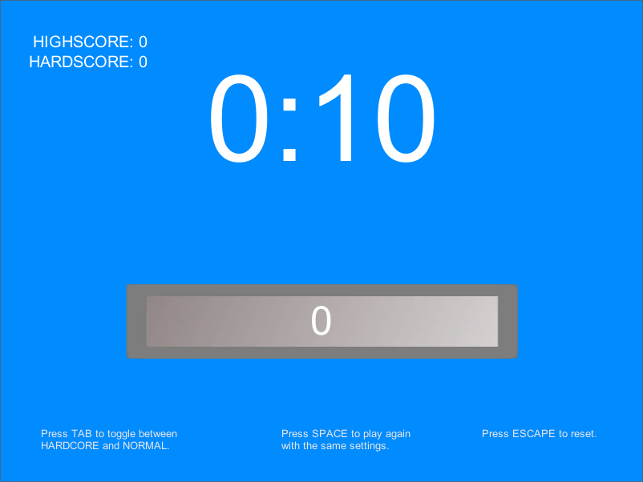

# game-a-week-four
by [@JonRaem](https://twitter.com/JonRaem/)

<h2> Background </h2>

 Back in the autumn of 2014 I decided to start a Game A Week project to improve my skills in game development. What is a Game A Week, you ask? It's pretty self explanatory: you have to make a game in a week and release it on the last day no matter what. This teaches not only working under a time constraint but also how to start, work on and finish a project within said time constraint. My project consisted of five parts and this is the fourth installment to it. 

 In <strong>Clicker</strong> you have 10 seconds to click the button as many times as you can! In normal mode every 25th click will increase your remaining time by 2 seconds. HARDCORE MODE only has the 10 second time limit with no bonuses. Enjoy! 

<h2> Installation </h2>
<ol>
  <li> To play this game, you must install Unity3D game engine from https://unity3d.com/. </li>
  <li> After you have installed the game engine, run the .exe file found in the root folder of the project to play the game. </li>
</ol>

---

